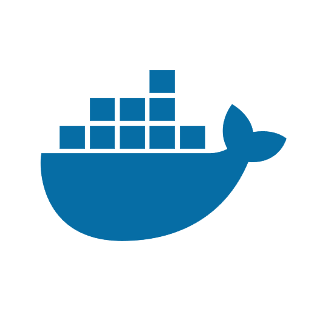

# Instrucciones
---
## Docker compose

Se puede levantar el front y back con **Docker**, con el siguiente comando:


```
  docker-compose -f docker-compose.yml up
```
Luego entrar en (nota: usamos puerto 80):
```
http://localhost/
```
### Comentarios

- Ranking sorteado por cantidad de grand slams ganados

- Fechas ordenadas de menor a mayor

- El método del server para obtener la fecha se cambió a GET

- Se cachea llamado de fecha cuando se hace clic en tenista

- En SpreadsheetService.js getWinner devuelve (count) la cantidad de torneos ganados en general

- En SpreadsheetService.js se simplificó los dos loops en uno


# Correr sin DOCKER
---

## Backend

Corriendo el back con NodeJS


```
  cd back
  npm install
  npm dev
```

Para cada grand slam los endpoints son:
```
  /winner/us-open\
  /winner/australian-open\
  /winner/wimbledon\
  /winner/roland-garros
  
  ```

Para obtener la última vez que lo ganó el jugador, se realiza un GET con el param el nombre del jugador. Los endpoints son:
```
  /winner/us-open/date/Rafael%20Nadal
  /winner/australian-open/date/Rafael%20Nadal
  /winner/wimbledon/date/Rafael%20Nadal
  /winner/roland-garros/date/Rafael%20Nadal
```
## Frontend

Arrancamos el proyecto frontend una vez que tengamos el backend corriendo de la siguiente forma:


```
  cd front
  npm install
  npm start
```


Luego entramos al front de ReactJS en la siguiente URI:

```
http://localhost:3000
```
